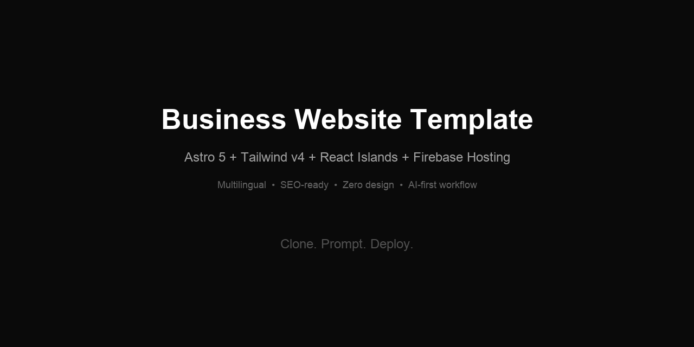
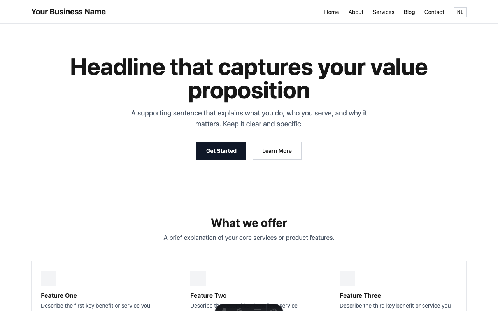
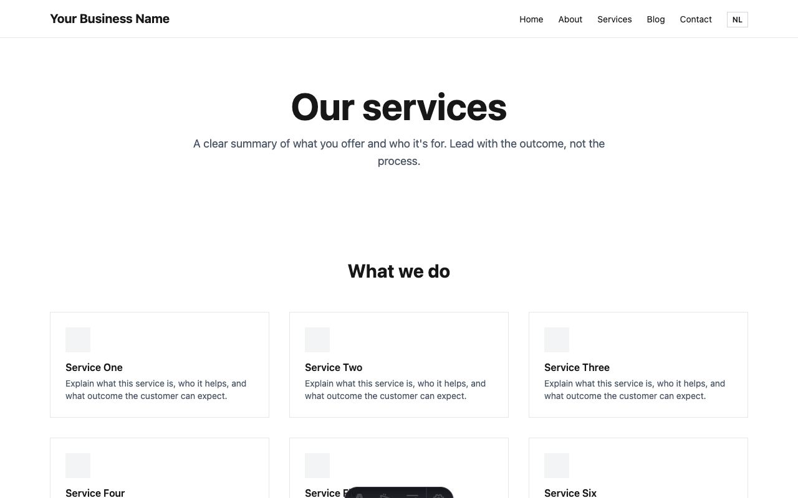
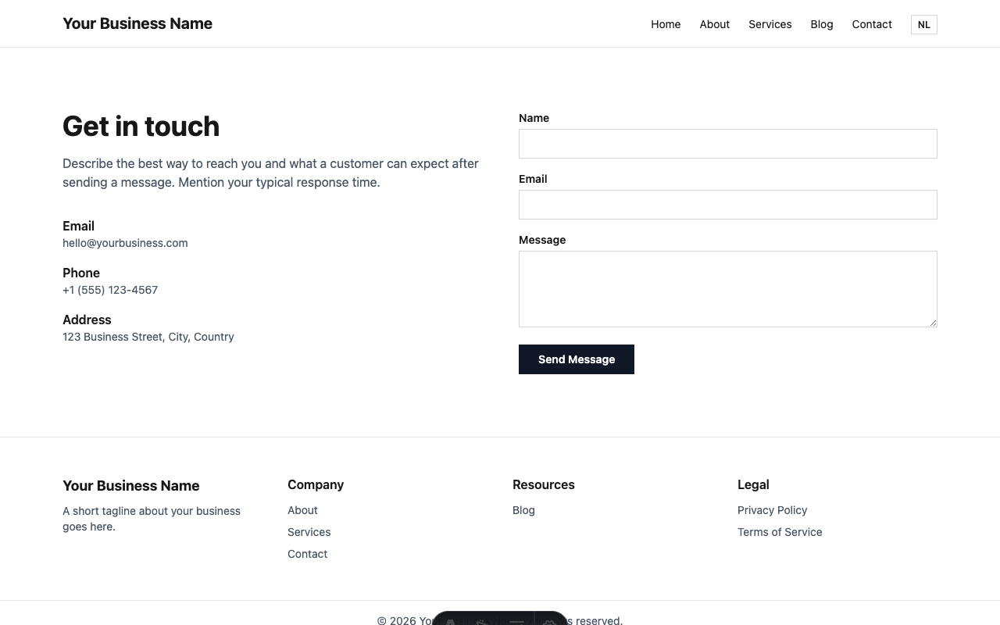
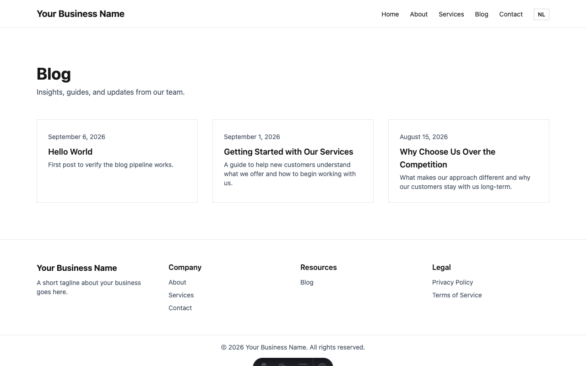
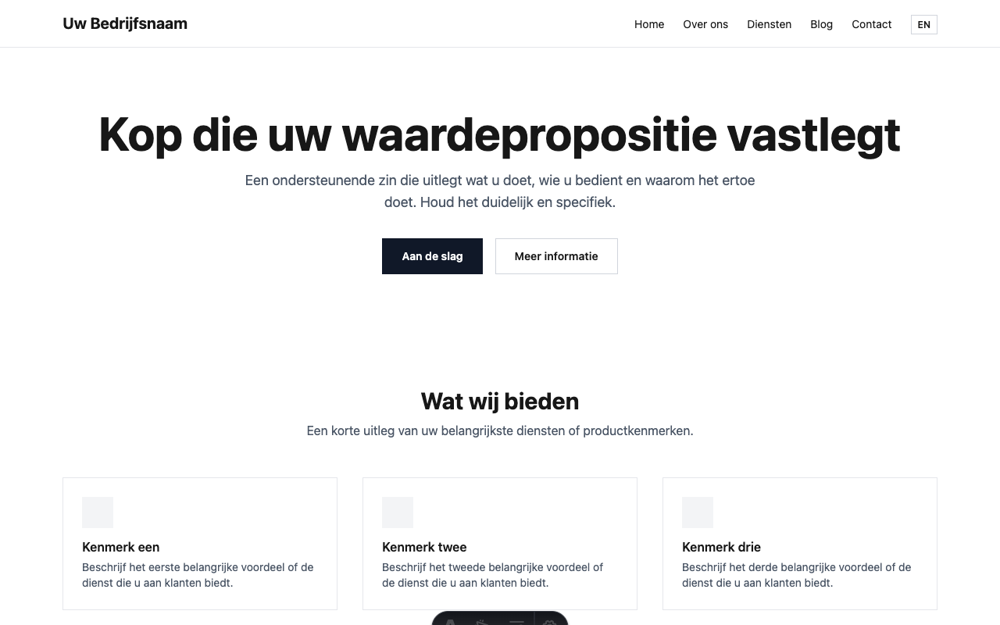

# Business Website Template

A ready-to-use Astro 5 skeleton for static business websites. All pages and components are functional with semantic HTML and placeholder content. Design is intentionally absent — bring your own brand by prompting an AI code assistant.

**Clone. Prompt. Deploy.**



## Stack

- **Astro 5** — static site generator
- **Tailwind v4** — utility-first CSS via `@tailwindcss/vite`
- **React Islands** — interactive components hydrated on scroll (`client:visible`)
- **MDX** — content collections for blog posts
- **Firebase Hosting** — CDN, deploy, PR preview channels
- **Multilingual** — built-in i18n with localized URLs (EN + NL included)

## Screenshots

| Homepage | Services | Contact |
|---|---|---|
|  |  |  |

| Blog | Dutch Homepage |
|---|---|
|  |  |

> Screenshots show the unstyled skeleton. After prompting for design, every page gets your brand's colors, typography, shadows, and spacing.

## Pages included

### English (default)

| Route | Description |
|---|---|
| `/` | Homepage — hero, features, stats, testimonials, CTA |
| `/about` | Company story, stats, values |
| `/services` | Service grid, how it works, FAQs (accordion) |
| `/contact` | Contact info + form (React island) |
| `/blog` | Blog post list |
| `/blog/[slug]` | Individual blog post (MDX) |
| `/privacy` | Privacy policy scaffold |
| `/terms` | Terms of service scaffold |
| `/404` | Not found page |

### Dutch (localized URLs)

| Route | Description |
|---|---|
| `/nl` | Homepage |
| `/nl/over-ons` | Over ons |
| `/nl/diensten` | Diensten |
| `/nl/contact` | Contact |
| `/nl/blog` | Blog |
| `/nl/blog/[slug]` | Blogpost |
| `/nl/privacybeleid` | Privacybeleid |
| `/nl/voorwaarden` | Algemene voorwaarden |

Plus: RSS feed (`/rss.xml`), sitemap, `robots.txt`, Open Graph + Twitter Card meta, JSON-LD structured data, language switcher in header.

## Quick start

```bash
# Clone
git clone https://github.com/YOUR_USERNAME/website-template.git my-site
cd my-site
npm install

# Develop
npm run dev

# Build
npm run build
npm run preview
```

## All text lives in one file per language

Every visible string on the site — page titles, headings, body text, button labels, nav links, SEO meta, form labels — lives in a single JSON file per language:

```
src/content/
  en.json    ← English
  nl.json    ← Dutch
```

To update any text, edit the JSON. To add a language, copy `en.json` to `de.json`, translate it, and add `'de'` to the locales array in `astro.config.mjs` and `src/lib/i18n.ts`.

## Design workflow

This template ships with zero design — no colors, no shadows, no rounded corners. Describe your brand to an AI code assistant and it skins everything in one session.

### Requirements

- [Claude Code](https://docs.anthropic.com/en/docs/claude-code/overview) (or any AI code assistant)
- [Chrome DevTools MCP extension](https://chromewebstore.google.com/detail/claude-code-chrome-extension/) (optional, enables visual QA)

### The loop

```
npm run dev                          # 1. Start dev server
claude                               # 2. Open Claude Code in the project
```

**Design** — prompt with a brand brief:
```
Design this site for a dental practice called "Bright Smile" in Amsterdam.
Brand colors: blue (#1e40af) primary, white surface. Style: clean, professional.
Update global.css tokens, then style all components with rounded corners,
subtle shadows, and hover states. Make the header sticky.
```

**Content** — prompt with the JSON file:
```
Read src/content/en.json and rewrite all content for a dental practice
specializing in cosmetic dentistry and implants. Target: adults 30-60
in Amsterdam. Keep the same JSON structure.
```

**Visual QA** — if you have Chrome DevTools MCP:
```
Take a screenshot of localhost:4321 and fix any spacing or alignment issues.
Check all pages on mobile (375px) and fix overflow problems.
Run a Lighthouse audit and fix performance/accessibility issues.
```

**Deploy:**
```bash
npm run build && npx firebase deploy
```

### Full guide

See **[docs/WORKFLOW.md](docs/WORKFLOW.md)** for the complete step-by-step walkthrough: Firebase setup, design prompting, visual QA with Chrome DevTools MCP, content writing, adding languages, deploying, and tips.

## Adding a new language

1. Copy `src/content/en.json` to `src/content/de.json` and translate
2. Add `'de'` to the `locales` array in `astro.config.mjs`
3. Add the import and entry in `src/lib/i18n.ts`
4. Copy `src/pages/nl/` to `src/pages/de/` and rename files to German slugs
5. Update hrefs in `de.json` to match the new routes
6. Add blog posts in `src/content/blog/de/`
7. Add a `blog-de` collection in `src/content.config.ts`

## Firebase setup

1. Replace `your-firebase-project-id` in `.firebaserc` and `.github/workflows/*.yml`
2. Replace `https://example.com` in `astro.config.mjs` and `public/robots.txt` with your domain
3. Add `FIREBASE_SERVICE_ACCOUNT` secret to GitHub (Firebase console > Service Accounts > Generate Key)
4. Replace `public/og-default.png` with your actual OG image (1200x630)

## Project structure

```
src/
  components/
    ui/           # Astro components (static, no JS shipped)
    islands/      # React components (hydrated on scroll)
  content/
    en.json       # All English text (pages, nav, SEO, form labels)
    nl.json       # All Dutch text
    blog/
      en/         # English blog posts (MDX)
      nl/         # Dutch blog posts (MDX)
  content.config.ts  # Typed collection schemas
  lib/
    i18n.ts       # t(locale) helper + blogCollection(locale)
  layouts/        # BaseLayout, BlogLayout
  pages/          # English routes (file-based routing)
    nl/           # Dutch routes (localized slugs)
  styles/
    global.css    # Tailwind v4 config + design tokens
  assets/
    images/       # Vite-processed images (content-hashed, immutable cache)
```

See `CLAUDE.md` for the full component inventory and AI builder instructions.

## Commands

| Command | Description |
|---|---|
| `npm run dev` | Start dev server at `localhost:4321` |
| `npm run build` | Production build to `dist/` |
| `npm run preview` | Preview production build |
| `npx firebase deploy` | Deploy to Firebase Hosting |
| `npx firebase hosting:channel:deploy preview` | Deploy preview channel |

## License

MIT
